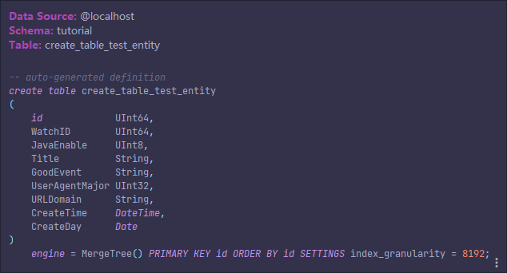
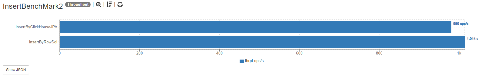
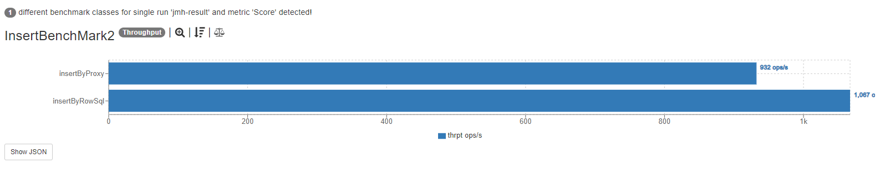
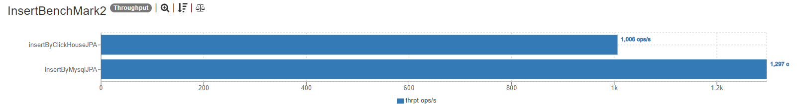
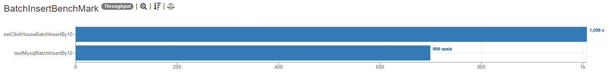
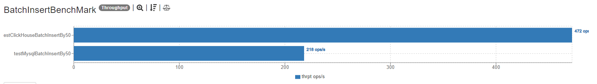
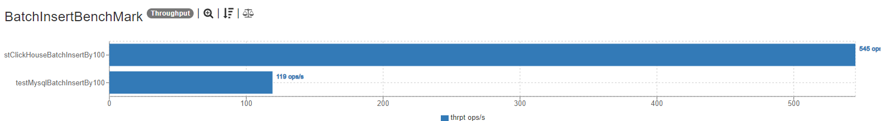
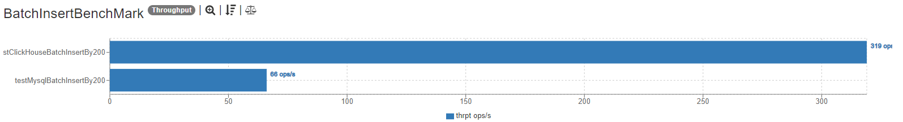

# clickhouse-jpa

由于毕设需要使用clickhouse，  
但是spring data jpa不支持clickhouse，（拒绝mybatis的xml）  
只能自己写一个风格类似的先凑合用了。（以后有空再写个jpa规范版）

## 安装方法（还在申请maven仓库，所以暂时只能本地安装）
1. clone本仓库
2. 在本地执行 mvn clean install

## 使用方法

1. 添加依赖
```xml
        <dependency>
            <groupId>asalty.fish</groupId>
            <artifactId>clickhouse-jpa</artifactId>
            <version>1.0.0-release</version>
        </dependency>
        <dependency>
            <groupId>com.github.housepower</groupId>
            <artifactId>clickhouse-native-jdbc</artifactId>
            <version>2.6.4</version>
        </dependency>
        <!-- https://mvnrepository.com/artifact/com.google.code.gson/gson -->
        <dependency>
            <groupId>cglib</groupId>
            <artifactId>cglib</artifactId>
            <version>3.3.0</version>
        </dependency>
        <!-- https://mvnrepository.com/artifact/com.zaxxer/HikariCP -->
        <!-- https://mvnrepository.com/artifact/com.zaxxer/HikariCP -->
        <dependency>
            <groupId>com.zaxxer</groupId>
            <artifactId>HikariCP</artifactId>
            <version>4.0.3</version>
        </dependency>
 ```
2. 填写配置文件
```yaml
spring:
  jpa:
    clickhouse:
      # clickhouse引擎
      driver-class-name: com.github.housepower.jdbc.ClickHouseDriver
      # clickhouse的url
      url: jdbc:clickhouse://localhost
      # clickhouse的端口
      port: 19000
      # clickhouse的数据库
      database: tutorial
      # clickhouse的用户名
      username: default
      # clickhouse的密码
      password:
      # 是否开启自动创建表\更新表
      table-update: true
      # 连接池配置
      hikari:
        # 连接池的最大连接数
        maximumPoolSize: 60
        # 空闲超时
        idleTimeout: 1000000
        # 连接超时时间
        connectionTimeout: 5000
```
3. 新建一个实体类（若开启自动建表，会在容器启动时自动创建该实体对应的表）
```java
@Data
@ClickHouseEntity
@ClickHouseTable(name = "create_table_test_entity", engine = ClickHouseEngine.MergeTree)
public class CreateTableTestEntity {

    @ClickHouseColumn(isPrimaryKey = true)
    public Long id;

    @ClickHouseColumn(comment = "观看id")
    public Long WatchID;

    public Boolean JavaEnable;

    @ClickHouseColumn(comment = "标题")
    public String Title;

    public String GoodEvent;

    public Integer UserAgentMajor;

    @ClickHouseColumn(name = "URLDomain")
    public String testUserDefinedColumn;

    public LocalDateTime CreateTime;

    public LocalDate CreateDay;

    public CreateTableTestEntity() {

    }
}
```
4. 新建一个dao（需要在注解中指定实体，方法内的逻辑随意填写）
```java
@ClickHouseRepository(entity = CreateTableTestEntity.class)
public class CreateTableTestEntityDao {

    public List<CreateTableTestEntity> findAllByWatchID(Long watchID) {
        return null;
    }

    public Boolean create(CreateTableTestEntity entity) {
        return null;
    }

    @ClickHouseNativeQuery("select count(*) from create_table_test_entity")
    public Long countAll() {
        return null;
    }

    public Long countWatchIDByWatchID(Long watchID) {
        return null;
    }

    public Long countWatchIDByWatchIDAndTitle(Long watchID, String title) {
        return null;
    }
}
```
5. 将dao注入到spring容器中使用
6. 开启自动建表后生成的表：


## 注解文档
### ClickHouseEntity
用于标记实体类
### ClickHouseTable
用于标记表名，默认为类名，可以指定表引擎，暂时只支持MergeTree
### ClickHouseRepository
用于标记dao，需要在注解中指定dao对应的实体类
### ClickHouseColumn
用于提供列的额外信息：列名（默认为字段名），是否为主键，注释内容（注释暂不支持写入表）。
### ClickHouseNativeQuery
用于标记原生sql查询，需要在注解中指定sql语句

## 现存的问题
1. 没写防注入的逻辑（clickhouse-jdbc就不支持，自己写太累了）
2. 自动生成的查询方法暂时只支持list返回值
3. 自动生成的查询方法暂时只支持And和Or查询
4. 自动生成的查询方法没有做大小写和列转换，所以需要保证方法名中的列名和实体类中的列名一致
5. 自动生成的插入方法暂时只支持单个对象插入
6. 没写更新和删除（好像也用不到）
7. 暂时支持的列类型只有：
```java
javaTypeToClickhouseMap.put(Long.class.getSimpleName(), "UInt64");
javaTypeToClickhouseMap.put(Integer.class.getSimpleName(), "UInt32");
javaTypeToClickhouseMap.put(Boolean.class.getSimpleName(), "UInt8");
javaTypeToClickhouseMap.put(String.class.getSimpleName(), "String");
javaTypeToClickhouseMap.put(LocalDateTime.class.getSimpleName(), "DateTime");
javaTypeToClickhouseMap.put(LocalDate.class.getSimpleName(), "Date");
javaTypeToClickhouseMap.put(Double.class.getSimpleName(), "Float64");
```

## 版本日志
### v1.0.1
1. 修复每个线程不能单独拥有一个数据库连接的问题

### v1.0.2
1. 提供生成的原生SQL的缓存（使用ConcurrentHashMap，日后考虑换caffeine）  
2. 修复了由于clickhouse读取出来的localdatetime格式为yyyyMMddTHHSS+时区导致的格式转换错误  

### v1.0.3
1. 修复了插入语句未缓存成功的问题
2. 提供了批量插入代理

## BenchMark（主程序开启12线程，运行5s，clickhouse和mysql均在32G 8核的debian虚拟机上）
### 与走JDBC的原生SQL比较
benchmark结果（12线程，5s）（1图为开启SQL缓存，2图为关闭SQL缓存）：  


可以看出，经过优化，框架的插入执行速率接近原生SQL执行。（我觉得如果把框架的日志去了可能还能更快一点）

### 单次写入与MySQL-JPA比较
benchmark结果：

可以看出，单次写入还是比mysql慢了不少(20%)的，后面可以优化一下批量写入。

### 批量写入与MySQL-JPA比较
1. 每次一次性写入10条时： 

可以看出，clickhouse此时已经反超mysql 40%
2. 每次一次性写入50条时

差距已经拉大到了130%
3. 每次一次性写入100条时

差距拉大到了360%
4. 每次一次性写入200条时

差距达到了惊人的380%

所以请尽量使用批量写入功能（batchCreate方法）